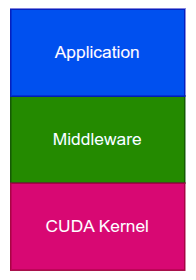
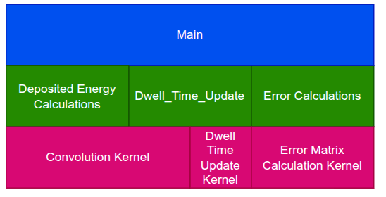
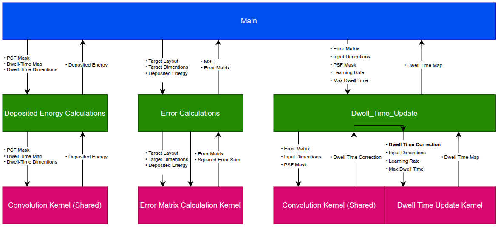
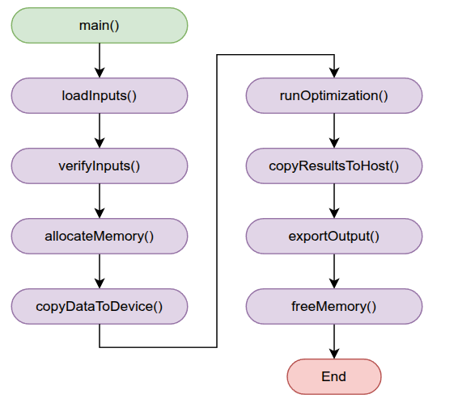
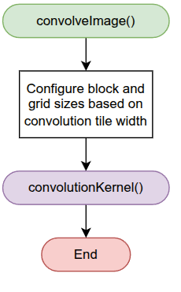
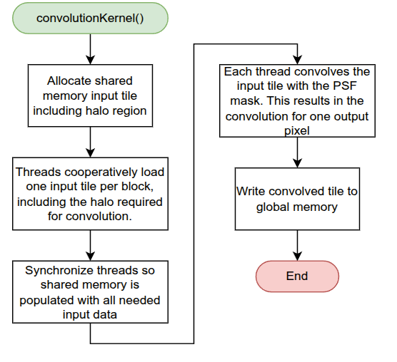
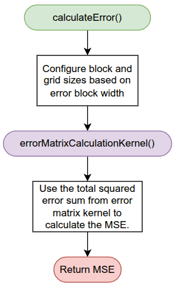
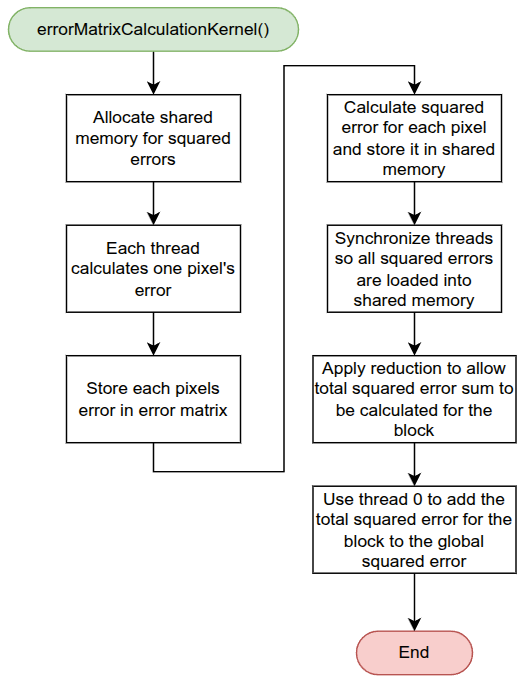

# CUDA Implementation
This directory contains the CUDA implementation of the EBL dwell time optimization algorithm. The implementation separates the algorithm into three main CUDA components.

## System Design

This system was designed with modularity in mind. Each layer represents a different responsibility within the system.
  

  ### Layer Definition

  

  This system was designed with modularity in mind. Each layer represents a different responsibility within the system.
    

  ### System Architecture

  

  Three components were developed in order to implement the Dwell Time EBL algorithm:

  1. **Deposited Energy Calculations**: Calculates the deposited energy by convolving the current dwell time map with the PSF. 
    - *Note: Convolution kernel is generic since both deposited energy and dwell time calculations require it.*

  2. **Error Calculations**: Compares the deposited energy with the target layout to generate the error matrix and calculate MSE.

  3. **Dwell Time Update:** Uses the error matrix to calculate a dwell time correction and update the dwell time map.
    

  ### System Interfacing

  

  - Being able to follow the data through the system is important.
  - With the layered design in place, each component is shown with an input and output which shows how they will interface with each other.

## Main Application Logic

Main handles the overall application execution:
- Handling input data
- Allocating memory
- Transferring data from the host to the GPU
- The algorithm itself
  - Includes logging run time parameters
- Transferring data from the GPU back to the host
- Storing results on file system
- Deallocating memory

## Component Implementation

  ### Deposited Energy

  

  

  - In order to calculate the deposited energy, the current dwell time map needs to be convolved with the PSF mask.
  - The tiling approach was used to allow each block to convolve a tile of the current dwell time map while still utilizing shared memory.
  - Cooperative loading was used to efficiently store the needed current dwell time map data into shared memory.

  ### Error Calculation
  
  
  
  
  For calculating the error, two things need to be done:

  1. Calculating the total squared error and error matrix between the target layout and the deposited energy

  2. Using the total squared error to calculate the MSE

  *Note: Reduction is used in the kernel to calculate the total squared error sum for each block.*

  ### Dwell Time Update

  Updating the dwell time is done in two steps:

  1. Convolving the error matrix with the PSF mask. This calculates how much the current dwell time map needs to be corrected

  2. Calculating and updating the current dwell time map using the dwell time map correction along with a specified learning rate. Conceptually it’s:
     - Current dwell time + (dwell time correction * learning rate)
