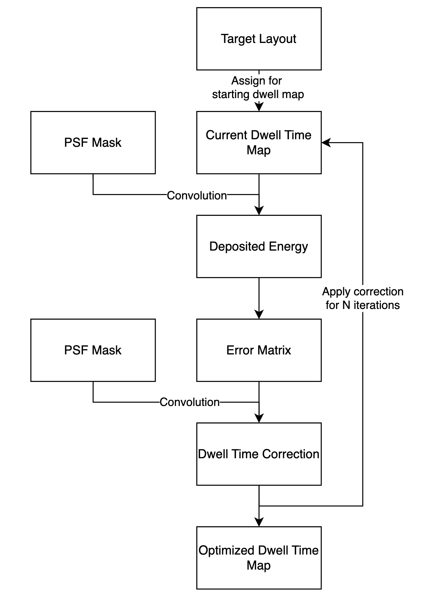
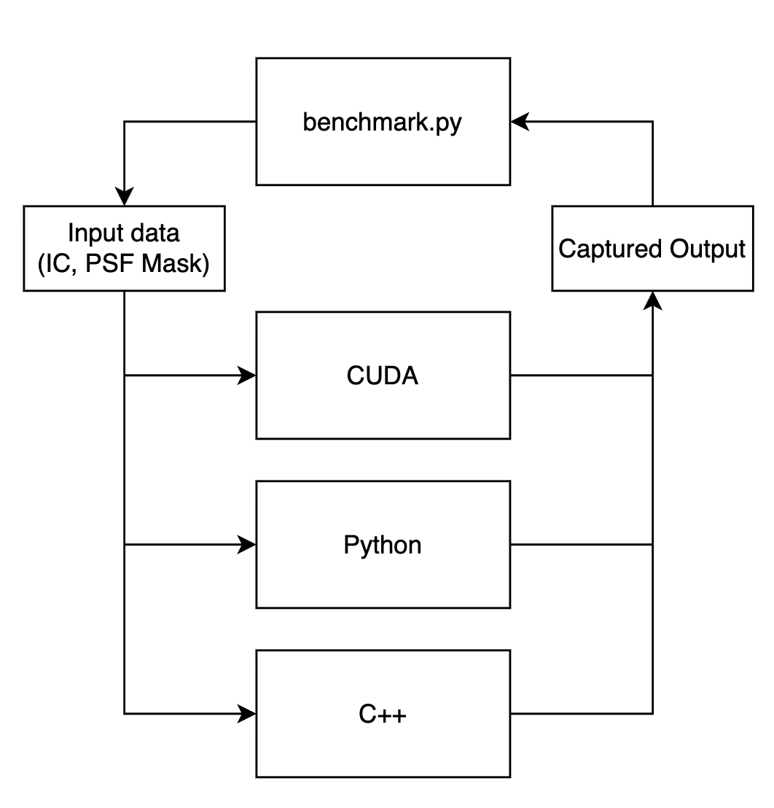

# GPU-EBL-Dwell-Time-Optimization

## Final Project Abstract

Electron Beam Lithography is the process of creating nanoscale structures using a focused beam of electrons. Due to its use in semiconductor manufacturing and other cutting edge fields, demand has only increased over time and will continue to do so. A persisting problem with the technology is the scattering of electrons from the beam. At the nanoscale, electrons do not act like rays, instead they scatter upon contact with the resist and substrate. Any attempt to expose a single point will expose the point and to a lesser degree the area surrounding the point as well. This fact must be taken into account when designing lithographic mask layouts. Previous research has been conducted in parallelizing this operation by altering what parts of the substrate are exposed. This was accomplished by iteratively changing the mask based on whether a location was exposed or not exposed. This paper proposes an improvement by not only altering the locations the beam is applied but also the amount of time the beam dwells at each location. Locations can have any level of exposure instead of the binary exposed and not exposed with the goal of the entire substrate being perfectly exposed. This method provides 3-5x lower MSE than a binary implementation at the cost of a 2x slowdown scaling with input size. Index Terms—Proximity effect correction (PEC), Electron beam lithography (EBL), Integrated circuits (IC), Compute Unified Device Architecture (CUDA).
  

## Project Artifacts
- [**Project Report**](./docs/GPU_EBL_Dwell_Time_Optimization_Report.pdf)
- [**Project Presentation**](./docs/GPU_EBL_Dwell_Time_Optimization_Slides.pdf)
  

## Algorithm and Architecture

The Electron Beam Lithography Dwell Time Optimization algorithm is described in the following flow diagram:

For more information on how the actual `CUDA` code is structured, view [this](./CUDA_Implementation/README.md) for system architecture, interfacing, and component implementation.

## Benchmarking

In order to see how well the `CUDA` code was performing, the sequential implementations allowed an insight into how much time was being saved by parallelizing this algorithm. For benchmarking the implementations, all programs were designed to have the same output and the same datasets were used. This allowed for the program to keep track of algorithm output as well as timing so the different implementations could be directly compared.

## Building Project

  ### Libraries

  This project uses `libwb` ([GitHub Repository for libwb](https://github.com/abduld/libwb)) for input/output, logging, and timing utilities.

  *Note: Only the `CUDA_Implementation` and `C++` implementations need `libwb`.*

  ### Source Code

  There are three implementations within this project. For building / installing dependencies, follow the corresponding guides:

  1. CUDA Implementation ([build instructions](./CUDA_Implementation/docs/cuda_build.md))
  2. Sequential C++ ([build instructions](./Sequential_Implementations/C++/docs/cpp_build.md))
  3. Sequential Python  ([virtual environment instructions](./Sequential_Implementations/Python/README.md))